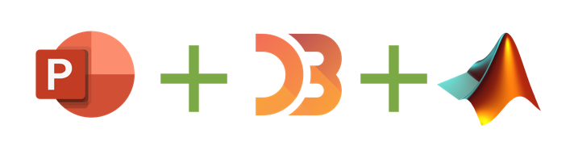
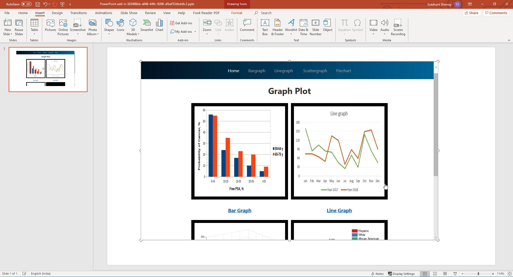
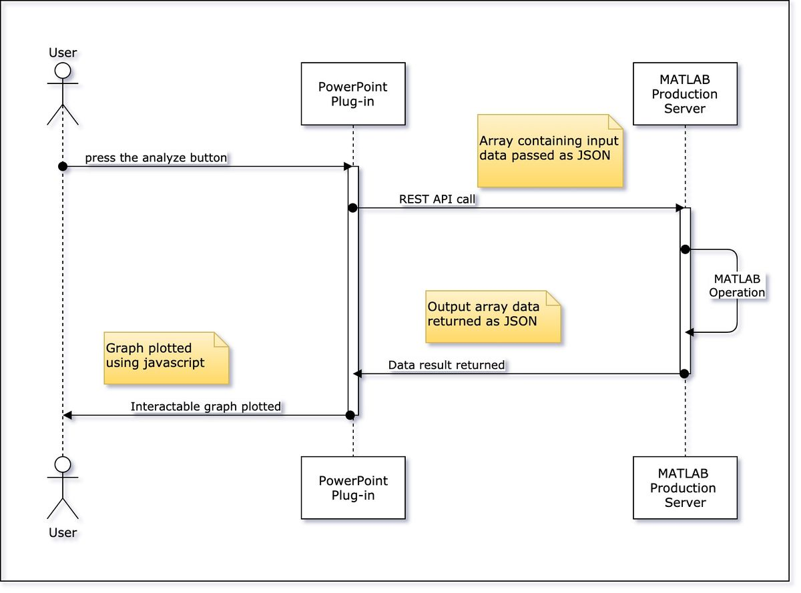

# Description
Create interactive graphs and execute custom MATLAB Server scripts through our Microsft Powerpoint add-in.

# Motivation
Currently, the Microsft Powerpoint does not offer interactive plots (like MATLAB does). It also can't perform any calculations on the data. In this project, we are making the plots in Microsoft Powerpoint interactive. This way, a user can generate interactive plots on the go during the presentation and this is backed up by the powerful MATLAB Production server.

# Workflow
1. User adds the custom Microsoft PowerPoint plug-in
2. User chooses the type of plot (Bar, Pie, Line, etc.)
3. User presses the "analyze" button
4. Client-side code sends an API request to MPS server with an input array as JSON
5. The MATLAB script running on the server will return the resulting output array as JSON
6. Client-side code parses the data and plots the interactive graph using Javascript which is viewed by the User on the PPT slide

For more usage details, [refer to this video.](https://web.microsoftstream.com/video/ed897f09-de7b-4eaf-a05f-ee9753c846ea)

# Sequence Diagram

